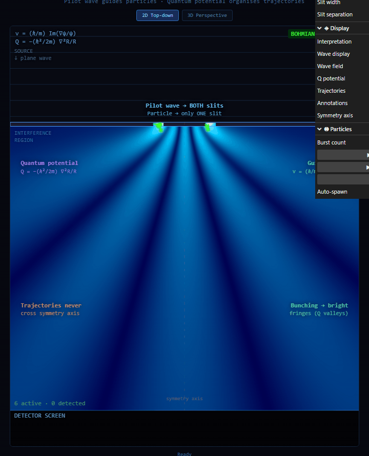

# Bohmian Mechanics — Double-Slit Experiment

An interactive visualisation of the double-slit experiment from the perspective of David Bohm's pilot wave theory (de Broglie-Bohm / Bohmian mechanics).

Particles have definite positions at all times. Their trajectories are guided by a real physical field — the pilot wave ψ — through the quantum potential Q. The interference pattern is not a mystery; it is the natural consequence of Q's topology.

## What you're seeing

| Element | Description |
|---|---|
| **Blue field** | The pilot wave \|ψ\|² — probability density. Passes through BOTH slits simultaneously |
| **Green trajectories** | Deterministic Bohmian particle paths guided by v = (ħ/m) Im(∇ψ/ψ) |
| **Detector strip** | The fringe pattern building up particle by particle — identical to QM prediction |
| **Q potential** (toggle) | Quantum potential Q = −(ħ²/2m)∇²R/R — the non-local field that organises trajectories |

### Key Bohmian features shown

- **Trajectories never cross the symmetry axis** — provable from the guidance equation
- **Bunching into bright fringes** — Q has valleys at high \|ψ\|² regions, pulling particles in
- **No wave function collapse** — the wave is a real field; detection is just a particle reaching the screen
- **Copenhagen contrast** — toggle to see the same field with no trajectories, particles "teleporting" to the detector

## Physics

The guidance equation determines particle velocity from the wave function:

```
v = (ħ/m) · Im(∇ψ / ψ)
```

The quantum potential is derived from the amplitude R = |ψ|:

```
Q = −(ħ²/2m) · ∇²R / R
```

The wave function is computed analytically via Huygens-Fresnel superposition (120 point sources per slit). Particle trajectories integrate via 4th-order Runge-Kutta through the velocity field.

## Controls

| Control | Effect |
|---|---|
| Slit width | Narrower = wider diffraction, fewer fringes |
| Slit separation | Larger = more fringes packed closer |
| Interpretation | Toggle Bohm (trajectories) vs Copenhagen (probability cloud only) |
| Wave display | `prob` = \|ψ\|², `real` = Re(ψ) oscillating crests |
| Q potential | Overlay the quantum potential field in plasma colourmap |
| Fire burst / single | Launch particles sampled from Born distribution |
| 3D Perspective | CSS perspective transform — drag to rotate the view |

Hover any control in the panel for a plain-English explanation of what it does physically.

## Stack

- Vite + TypeScript — no framework
- HTML5 Canvas 2D (HiDPI/retina aware)
- lil-gui — parameter controls
- Pure physics: no physics library, all equations derived from first principles

## Running locally

```bash
npm install
npm run dev
```

Open [http://localhost:5173](http://localhost:5173).

## References

- Bohm, D. (1952). *A Suggested Interpretation of the Quantum Theory in Terms of "Hidden" Variables*. Physical Review, 85(2), 166-179.
- Holland, P.R. (1993). *The Quantum Theory of Motion*. Cambridge University Press.
- Philippidis, C., Dewdney, C., & Hiley, B.J. (1979). *Quantum interference and the quantum potential*. Il Nuovo Cimento B, 52(1), 15-28. (The original Bohmian trajectory paper with the double-slit)
